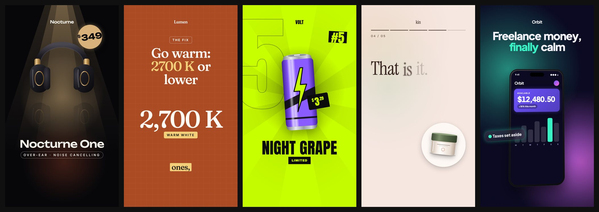
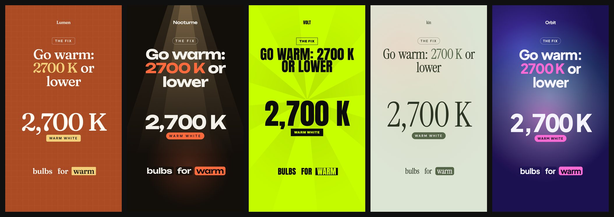

# Reelsmith

**A repo your coding agent uses to make on-brand TikToks, Reels and Shorts.**
Clone it, open it in Claude Code, Codex, Cursor or any agent, and ask for a video.
The agent reads the brand, writes the script, builds or picks a template, adds
voiceover with word-synced captions, **grades its own frames**, fixes what's wrong
and renders the MP4 — with [Remotion](https://www.remotion.dev/) under the hood.



<sub>The five example templates, each with its own demo brand: `ProductSpotlight`
(Nocturne), `Explainer` (Lumen), `TopList` (VOLT), `KineticCaptions` (kin), `AppPromo` (Orbit).</sub>

## Brands are one file — and they change everything

Every template is built from a small design system that reads the brand's theme.
Swap the brand and the same video takes on a different typeface, palette, shape
language, backdrop and motion:



```ts
// brands/acme/theme.ts — only id, name, url, colors and fonts are required
export default defineTheme({
  id: 'acme', name: 'Acme', url: 'acme.com',
  colors: { bg, surface, text, muted, line, primary, onPrimary, accent, onAccent },
  fonts: { display: { family: 'Fraunces', weights: ['600'] }, body: { family: 'Inter' } },
  tones: [...],                                   // scene color schemes templates rotate through
  shape: { radius: 6, border: 1, shadow: 'soft' },              // none | soft | hard | glow
  motion: { reveal: 'mask', ease: [0.25, 1, 0.5, 1], enter: 20 }, // rise fade pop blur mask slide
  backdrop: { kind: 'grid', grain: 0.05 },        // solid grid dots mesh spotlight rays
  components: { Backdrop: MyBackdrop },           // or replace any primitive outright
});
```

Three layers, each editable by the agent: **theme** (tokens, tones, component
overrides) → **primitives** (`src/theme/primitives`: Frame, Words, Reveal, Surface,
Price, Product, Phone, Captions, DomainCta…) → **templates** (one file each in
`src/templates/`). New formats are expected: the agent builds them from the primitives.

## Built for agents (and their token budgets)

- `pnpm reelsmith context` — the whole map in ~40 lines: what to edit where, brands, templates.
- `pnpm reelsmith describe <Template>` — compact TypeScript-style props + example (~600 tokens, not a JSON Schema dump).
- **Tiny job files** — a narrated scene is `{ "id": "hook", "say": "Your desk is *killing* your focus." }`.
  Timing comes from the voiceover (or word count); word timings live in sidecar files next to the audio.
- **One small contact sheet** per review, with problems boxed in place.
- **Skills** in `skills/` (open SKILL.md format), already linked for Claude Code (`.claude/skills`)
  and Codex & co. (`.agents/skills`), plus [`AGENTS.md`](AGENTS.md):
  `reelsmith` (make a video) · `reelsmith-design` (brands, themes, templates) · `reelsmith-review` (verify).

## Self-review that catches real problems

`pnpm reelsmith review jobs/<slug>.json` renders key frames with an audit running
_inside_ the real render, then checks the pixels:

- text clipped, off-canvas, overlapping, too small, or under TikTok/Reels UI
- contrast measured against what is **actually behind** the text
- text that exists in the DOM but never got painted
- missing assets, speech cut off by short scenes, reading speed, hook by 0.8 s, total length
- literal colors/fonts in templates (off-brand code)

It scores the job, keeps a score history, and the skill makes the agent add a
taste rubric (hook, clarity, brand fit, composition, variety, CTA) and iterate until
it passes. `pnpm reelsmith brand <id>` checks every color pair of a theme up front.

## Quick start

Node 20+ and pnpm (`corepack enable`). Remotion ships its own headless Chrome and ffmpeg.

```bash
git clone https://github.com/Flurin17/reelsmith.git && cd reelsmith
pnpm install
cp .env.example .env.local        # optional: ELEVENLABS_API_KEY for voiceovers

pnpm reelsmith context
pnpm reelsmith review examples/jobs/volt-top-5.json
pnpm reelsmith render examples/jobs/volt-top-5.json        # → out/volt-top-5.mp4
pnpm studio                                                # Remotion Studio, for humans
```

Then just ask your agent, e.g.:

> Add our brand from acme.com, then make a 20-second explainer about our three
> best-selling lamps and review it until it passes.

## Commands

|  |  |
| --- | --- |
| `context` · `describe <T>` · `brand [id]` · `catalog --brand id` | orient |
| `new <T> <slug> --brand id` · `make <T> --brand id …` · `validate` | create jobs |
| `voiceover <job>` · `review <job>` · `stills <job>` · `render <job>` | produce |
| `voices` · `audition` · `sfx` · `cutout` | assets |

## Data, voice, assets

- **Catalog per brand:** `brands/<id>/products.json`, `products.csv`, or `catalog.ts`
  (`export default async () => Product[]` — query your DB/Shopify/API there).
- **Voice:** ElevenLabs `eleven_v3` per scene with character timestamps → captions + timing.
  Configure voices in `reelsmith.config.ts`.
- **Assets:** product images, logos and fonts in `public/brands/<id>/`; licensed music in
  `public/music/` (git-ignored). SFX are synthesised by code (`pnpm reelsmith sfx`).

## Licensing

Reelsmith's code, generated SFX and demo artwork are **MIT**. It depends on
**Remotion, which is not open source**: free for individuals, non-profits and companies
with up to 3 employees; larger companies need a [Remotion license](https://www.remotion.dev/license).
